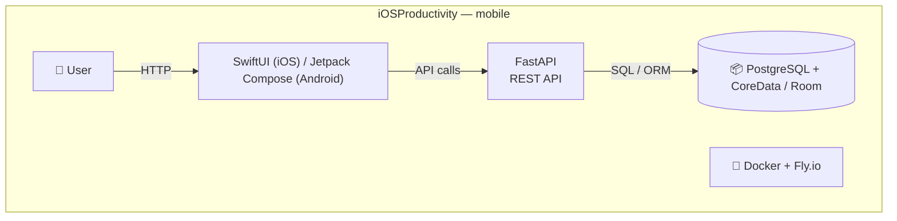
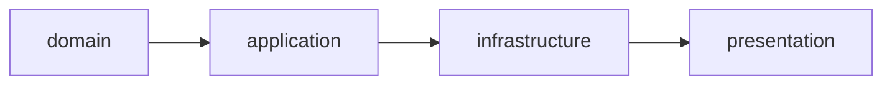

# iOSProductivity — System Architecture

## Architecture Pattern: Clean

### Layers

> Stack: lang=Swift / Kotlin | fe=SwiftUI (iOS) / Jetpack Compose (Android) | be=FastAPI | db=PostgreSQL + CoreData / Room | infra=Docker + Fly.io
