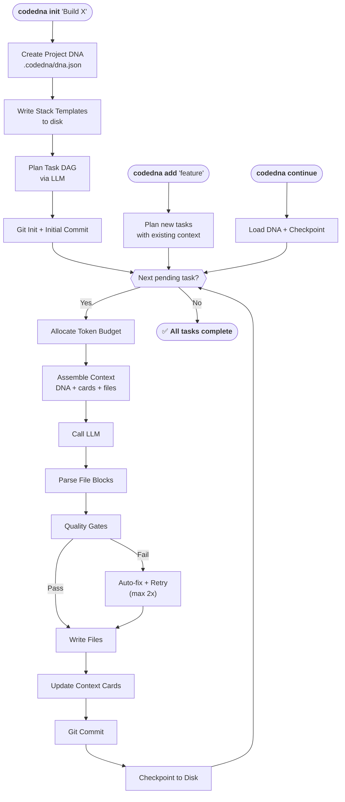

# CodeDNA — Execution Loop

## Key Properties

| Property | Value |
|----------|-------|
| LLM agnostic | ✅ Works with any provider via LiteLLM |
| Resumable | ✅ Checkpoint after every task |
| Token efficient | ✅ Context cards not full files |
| Identity preserving | ✅ DNA injected into every prompt |
| Scalable | ✅ Multiple LLMs/engineers via shared DNA |
| Version controlled | ✅ Every task = structured git commit |
