# iOSProductivity — Task Execution Plan

Progress: **37/37 tasks** (100% complete)

```mermaid
graph TD
  scaffold_project_structure(["scaffold_project_structure: Create the base project directory s…"])
  style scaffold_project_structure fill:#22c55e,color:#fff
  implement_fastapi_routes(["implement_fastapi_routes: Implement basic CRUD routes for tas…"])
  style implement_fastapi_routes fill:#22c55e,color:#fff
  implement_database_migrations(["implement_database_migrations: Implement initial database migratio…"])
  style implement_database_migrations fill:#22c55e,color:#fff
  test_domain_models(["test_domain_models: Write unit tests for the domain mod…"])
  style test_domain_models fill:#22c55e,color:#fff
  test_application_use_cases(["test_application_use_cases: Write unit tests for the applicatio…"])
  style test_application_use_cases fill:#22c55e,color:#fff
  test_infrastructure_repositories(["test_infrastructure_repositories: Write unit tests for the infrastruc…"])
  style test_infrastructure_repositories fill:#22c55e,color:#fff
  scaffold_dockerfile(["scaffold_dockerfile: Create a Dockerfile for the FastAPI…"])
  style scaffold_dockerfile fill:#22c55e,color:#fff
  scaffold_project_structure --> scaffold_dockerfile
  scaffold_flyio_config(["scaffold_flyio_config: Create Fly.io configuration files f…"])
  style scaffold_flyio_config fill:#22c55e,color:#fff
  scaffold_project_structure --> scaffold_flyio_config
  scaffold_ios_app_delegate(["scaffold_ios_app_delegate: Scaffold the AppDelegate for the iO…"])
  style scaffold_ios_app_delegate fill:#22c55e,color:#fff
  scaffold_project_structure --> scaffold_ios_app_delegate
  scaffold_android_main_activity(["scaffold_android_main_activity: Scaffold the MainActivity for the A…"])
  style scaffold_android_main_activity fill:#22c55e,color:#fff
  scaffold_project_structure --> scaffold_android_main_activity
  scaffold_domain_models(["scaffold_domain_models: Scaffold core domain models (e.g., …"])
  style scaffold_domain_models fill:#22c55e,color:#fff
  scaffold_project_structure --> scaffold_domain_models
  document_readme(["document_readme: Create a README.md file with projec…"])
  style document_readme fill:#22c55e,color:#fff
  scaffold_project_structure --> document_readme
  document_architecture(["document_architecture: Document the Clean Architecture and…"])
  style document_architecture fill:#22c55e,color:#fff
  scaffold_project_structure --> document_architecture
  test_fastapi_routes(["test_fastapi_routes: Write integration tests for the Fas…"])
  style test_fastapi_routes fill:#22c55e,color:#fff
  implement_fastapi_routes --> test_fastapi_routes
  scaffold_ios_app_entry_point(["scaffold_ios_app_entry_point: Scaffold the main App struct for th…"])
  style scaffold_ios_app_entry_point fill:#22c55e,color:#fff
  scaffold_ios_app_delegate --> scaffold_ios_app_entry_point
  scaffold_android_app_entry_point(["scaffold_android_app_entry_point: Scaffold the main Application class…"])
  style scaffold_android_app_entry_point fill:#22c55e,color:#fff
  scaffold_android_main_activity --> scaffold_android_app_entry_point
  scaffold_application_use_cases(["scaffold_application_use_cases: Scaffold base use case interfaces/a…"])
  style scaffold_application_use_cases fill:#22c55e,color:#fff
  scaffold_domain_models --> scaffold_application_use_cases
  scaffold_infrastructure_repositories(["scaffold_infrastructure_repositories: Scaffold base repository interfaces…"])
  style scaffold_infrastructure_repositories fill:#22c55e,color:#fff
  scaffold_domain_models --> scaffold_infrastructure_repositories
  setup_ci_cd(["setup_ci_cd: Set up basic CI/CD pipeline configu…"])
  style setup_ci_cd fill:#22c55e,color:#fff
  test_fastapi_routes --> setup_ci_cd
  implement_database_migrations --> setup_ci_cd
  scaffold_presentation_ios_design_system(["scaffold_presentation_ios_design_system: Scaffold the iOS Design System comp…"])
  style scaffold_presentation_ios_design_system fill:#22c55e,color:#fff
  scaffold_ios_app_entry_point --> scaffold_presentation_ios_design_system
  scaffold_presentation_android_design_system(["scaffold_presentation_android_design_system: Scaffold the Android Design System …"])
  style scaffold_presentation_android_design_system fill:#22c55e,color:#fff
  scaffold_android_app_entry_point --> scaffold_presentation_android_design_system
  scaffold_infrastructure_database_config(["scaffold_infrastructure_database_config: Scaffold database configuration for…"])
  style scaffold_infrastructure_database_config fill:#22c55e,color:#fff
  scaffold_infrastructure_repositories --> scaffold_infrastructure_database_config
  implement_task_list_view_ios(["implement_task_list_view_ios: Implement the Task List view for iO…"])
  style implement_task_list_view_ios fill:#22c55e,color:#fff
  scaffold_presentation_ios_design_system --> implement_task_list_view_ios
  implement_productivity_stats_view_ios(["implement_productivity_stats_view_ios: Implement the Productivity Stats vi…"])
  style implement_productivity_stats_view_ios fill:#22c55e,color:#fff
  scaffold_presentation_ios_design_system --> implement_productivity_stats_view_ios
  implement_calendar_view_ios(["implement_calendar_view_ios: Implement the Calendar view for iOS…"])
  style implement_calendar_view_ios fill:#22c55e,color:#fff
  scaffold_presentation_ios_design_system --> implement_calendar_view_ios
  implement_dashboard_view_ios(["implement_dashboard_view_ios: Implement the Dashboard view for iO…"])
  style implement_dashboard_view_ios fill:#22c55e,color:#fff
  scaffold_presentation_ios_design_system --> implement_dashboard_view_ios
  implement_task_editor_view_ios(["implement_task_editor_view_ios: Implement the Task Editor view for …"])
  style implement_task_editor_view_ios fill:#22c55e,color:#fff
  scaffold_presentation_ios_design_system --> implement_task_editor_view_ios
  implement_focus_mode_view_ios(["implement_focus_mode_view_ios: Implement the Focus Mode view for i…"])
  style implement_focus_mode_view_ios fill:#22c55e,color:#fff
  scaffold_presentation_ios_design_system --> implement_focus_mode_view_ios
  test_ios_ui_components(["test_ios_ui_components: Write unit tests for the iOS SwiftU…"])
  style test_ios_ui_components fill:#22c55e,color:#fff
  scaffold_presentation_ios_design_system --> test_ios_ui_components
  implement_task_list_view_android(["implement_task_list_view_android: Implement the Task List view for An…"])
  style implement_task_list_view_android fill:#22c55e,color:#fff
  scaffold_presentation_android_design_system --> implement_task_list_view_android
  implement_productivity_stats_view_android(["implement_productivity_stats_view_android: Implement the Productivity Stats vi…"])
  style implement_productivity_stats_view_android fill:#22c55e,color:#fff
  scaffold_presentation_android_design_system --> implement_productivity_stats_view_android
  implement_calendar_view_android(["implement_calendar_view_android: Implement the Calendar view for And…"])
  style implement_calendar_view_android fill:#22c55e,color:#fff
  scaffold_presentation_android_design_system --> implement_calendar_view_android
  implement_dashboard_view_android(["implement_dashboard_view_android: Implement the Dashboard view for An…"])
  style implement_dashboard_view_android fill:#22c55e,color:#fff
  scaffold_presentation_android_design_system --> implement_dashboard_view_android
  implement_task_editor_view_android(["implement_task_editor_view_android: Implement the Task Editor view for …"])
  style implement_task_editor_view_android fill:#22c55e,color:#fff
  scaffold_presentation_android_design_system --> implement_task_editor_view_android
  implement_focus_mode_view_android(["implement_focus_mode_view_android: Implement the Focus Mode view for A…"])
  style implement_focus_mode_view_android fill:#22c55e,color:#fff
  scaffold_presentation_android_design_system --> implement_focus_mode_view_android
  test_android_ui_components(["test_android_ui_components: Write unit tests for the Android Je…"])
  style test_android_ui_components fill:#22c55e,color:#fff
  scaffold_presentation_android_design_system --> test_android_ui_components
  scaffold_infrastructure_fastapi_app(["scaffold_infrastructure_fastapi_app: Scaffold the base FastAPI applicati…"])
  style scaffold_infrastructure_fastapi_app fill:#22c55e,color:#fff
  scaffold_infrastructure_database_config --> scaffold_infrastructure_fastapi_app
```

| Status | Count |
|--------|-------|
| ✅ Completed | 37 |
| 🔄 In Progress | 0 |
| ⏳ Pending | 0 |
| ❌ Failed | 0 |
